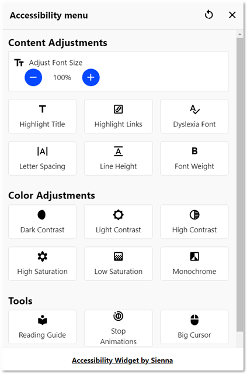

Accessibility Sidebar plugin for Moodle LMS
===========================================

IMPORTANT NOTE: This plugin is under development. Use at your own risk!

# Table of Contents

- [Accessibility Sidebar plugin for Moodle LMS](#accessibility-sidebar-plugin-for-moodle-lms)
- [Table of Contents](#table-of-contents)
- [Basic Overview](#basic-overview)
  - [Features:](#features)
- [Requirements](#requirements)
- [Download](#download)
- [Installation](#installation)
  - [Installing via uploaded ZIP file](#installing-via-uploaded-zip-file)
  - [Installing manually](#installing-manually)
- [Usage](#usage)
  - [Configuring Settings](#configuring-settings)
- [Updating](#updating)
- [Uninstallation](#uninstallation)
- [Limitations](#limitations)
- [Language Support](#language-support)
- [FAQ](#faq)
  - [Are there any security considerations?](#are-there-any-security-considerations)
- [Where can I get support for this plugin?](#where-can-i-get-support-for-this-plugin)
- [Contributing](#contributing)
  - [Contributors](#contributors)
- [Motivation for this plugin](#motivation-for-this-plugin)
- [Further information](#further-information)
- [License](#license)

# Basic Overview

This is a port for Moodle LMS of the [Sienna Accessibility Widget](https://accessibility-widget.pages.dev/).

The Accessibility Sidebar plugin adds a widget button to the bottom left of your Moodle LMS site (not available for Admin pages). When a user clicks on it, it offers the user a collection of accessibility tools.

## Features:

* Changing the font size
* Highlighting titles
* Highlighting links
* Switching to a dyslexia friendly font
* Changing the letter spacing
* Changing the line height
* Changing the font weight
* Changing the contrast
* Changing the saturation
* Switching to monochrome
* Enabling a reading guide
* Stopping animation
* Increasing the size of the mouse pointer

[(Back to top)](#table-of-contents)

# Requirements

- Moodle LMS 3.9 or higher.
- PHP 7.4 or higher.

[(Back to top)](#table-of-contents)

# Download

The most recent [development release](https://github.com/michael-milette/moodle-local_acsb).

This plugin is NOT yet available from https://moodle.org/plugins/local_acsb

[(Back to top)](#table-of-contents)

# Installation

Install the plugin, like any other plugin, to the following folder:

    /local/acsb

See the [documentation on Moodle.org](http://docs.moodle.org/en/Installing_plugins) for details on installing Moodle LMS plugins.

There are no special considerations required for updating the plugin.

## Installing via uploaded ZIP file ##

1. Log in to your Moodle LMS site as an admin and go to **Site administration > Plugins > Install plugins**.
2. Upload the ZIP file with the plugin code. You should only be prompted to add extra details if your plugin type is not automatically detected.
3. Check the plugin validation report and finish the installation.

## Installing manually ##

The plugin can be also installed by putting the contents of this directory to

    {your/moodle/dirroot}/local/acsb

Afterwards, log in to your Moodle LMS site as an admin and go to **Site administration > Notifications** to complete the installation.

Alternatively, you can run

    $ php admin/cli/upgrade.php

to complete the installation from the command line

[(Back to top)](#table-of-contents)

# Usage

## Configuring Settings

You can enable or disable the Accessibility Sidebar by going to **Site Administration > Plugins > Local > Accessibility Sidebar**.

Once enabled,it will show up on web pages. If it does not at first, press ctrl-r or cmd-r to reload the page.

# Updating

There are no special considerations required for updating the plugin.

The first public ALPHA version was released on 2024-01-27.

For more information on releases since then, see [CHANGELOG.md](https://github.com/michael-milette/moodle-local_acsb/blob/master/CHANGELOG.md).

[(Back to top)](#table-of-contents)

# Uninstallation

Uninstalling the plugin by going into the following:

**Site Administration > Plugins > Manage plugins > Accessibility Sidebar**.

...and click Uninstall. You may also need to manually delete the following folder:

    /local/acsb

[(Back to top)](#table-of-contents)

# Limitations

The widget should show up on all user facing pages. However, it does not currently appear on some site pages (e.g. Site Administration).

See the [up-to-date list of issues](https://github.com/michael-milette/moodle-local_acsb/issues)

[(Back to top)](#table-of-contents)

# Language Support

The Accessibility Sidebar includes support for the following languages:

* Arabic
* Chinese
* Croatian
* English
* French
* German
* Greek
* Hebrew
* Hindi
* Indonesian
* Italian
* Japanese
* Korean
* Malay
* Portuguese
* Romanian
* Serbian
* Spanish
* Turkish

If you are using an unsupported language, it will default to English. Note that it does not use Moodle LMS' language packs.

If you need a different language that is not yet supported, please feel free to submit a pull request to the [parent project](https://github.com/bennyluk/Sienna-Accessibility-Widget).

This plugin has not been tested for right-to-left (RTL) language support. If you want to use this plugin with a RTL language and it doesn't work as-is, feel free to submit a [pull request](https://github.com/bennyluk/Sienna-Accessibility-Widget).

[(Back to top)](#table-of-contents)

# FAQ

See the [list of known issues](https://accessibility-widget.pages.dev/#faq).

For up to date information regarding the port to Moodle LMS, please see https://github.com/michael-milette/moodle-local_acsb/issues

[(Back to top)](#table-of-contents)

## Are there any security considerations?

This plugin does not have any known security considerations at this time.

# Where can I get support for this plugin?

There is no free support for this plugin. For premium support, [contact TNG Consulting Inc.](https://www.tngconsulting.ca/contact).

[(Back to top)](#table-of-contents)

# Contributing

If you are interested in helping, please take a look at our [contributing](https://github.com/michael-milette/moodle-local_acsb/blob/master/CONTRIBUTING.md) guidelines for details on our code of conduct and the process for submitting pull requests to us.

## Contributors

- Michael Milette (TNG Consulting Inc.) - Author and Lead Developer of Moodle LMS plugin.
- Benny Luk (Sienna) - Developer and maintainer of the widget.
- Original code at [github.com/bennyluk/Sienna-Accessibility-Widget](https://github.com/bennyluk/Sienna-Accessibility-Widget)
- [Contributors](https://github.com/michael-milette/moodle-local_acsb/wiki/Authors-and-Contributors)

[(Back to top)](#table-of-contents)

# Motivation for this plugin

The development of this plugin was motivated through interactions with clients of TNG Consulting Inc. comments in the Moodle support forums.

[(Back to top)](#table-of-contents)

# Further information

For further information regarding the local_acsb plugin, support or to report a bug, please visit the project page at:

https://github.com/michael-milette/moodle-local_acsb

[(Back to top)](#table-of-contents)

# License

Copyright © 2024 Consulting Inc. <https://www.tngconsulting.ca/> - Moodle LMS port under the GNU GPL license.

Copyright © 2023-2024 Benny Luk <https://accessibility-widget.pages.dev/> - MIT License.

This file is part of Accesibility Sidebar for Moodle - https://moodle.org/

Accesibility Sidebar is free software: you can redistribute it and/or modify
it under the terms of the GNU General Public License as published by
the Free Software Foundation, either version 3 of the License, or
(at your option) any later version.

Accesibility Sidebar is distributed in the hope that it will be useful,
but WITHOUT ANY WARRANTY; without even the implied warranty of
MERCHANTABILITY or FITNESS FOR A PARTICULAR PURPOSE.  See the
GNU General Public License for more details.

You should have received a copy of the GNU General Public License
along with Accesibility Sidebar.  If not, see <https://www.gnu.org/licenses/>.

[(Back to top)](#table-of-contents)
